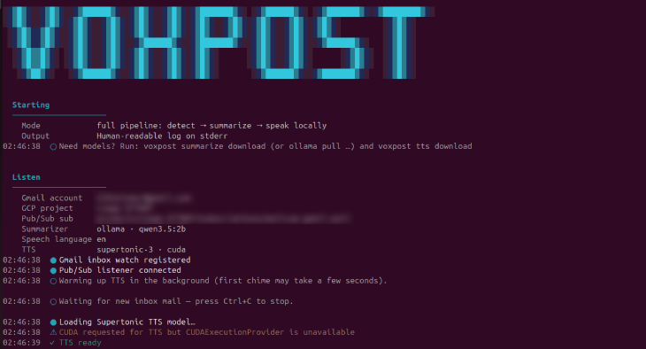

<p align="center">
  
</p>

**Hear what arrived — without opening another tab.**

Voxpost is a **local, on-device** desktop companion: when something important lands in **Gmail**, you get a **short spoken line** (who, and what it’s about), not a wall of text read aloud and not a cloud text-to-speech API.

<p align="center">
  <a href="docs/assets/terminal.png">
    
  </a>
</p>

<p align="center">
  <sub><em><code>voxpost listen --speak</code> · detect → summarize → speak · human-readable log on stderr</em></sub>
</p>

---

## The problem

Many of us **watch the inbox** while coding or deep in another app — tab back to Gmail or notifications just to see if something finished or if a message matters. That breaks focus. Existing “read aloud” tools often **dump too much audio** or send your text to **hosted TTS**.

Voxpost is the opposite: **one actionable sentence**, **on your machine**, when you choose to allow it.

---

## The idea (v1)

| Today | Later (not v1) |
|--------|----------------|
| **Gmail only** | Other sources (RSS, calendar, system notifications, chat apps, …) |

**v1 scope:** personal Gmail → **one speakable line** → local voice synthesis. **Filter rules** (VIP senders, keywords, quiet hours) ship with the **desktop settings UI**, not as a CLI-only block before that.

**Not v1:** WhatsApp/Instagram APIs, multi-OS polish, smart LLM summaries, or replacing your mail client.

---

## Building blocks

Development proceeds in layers. **Block 1** must work before anything else:

| Block | Scope | Status |
|-------|--------|--------|
| **1 — Gmail events** | OAuth, `watch`, Pub/Sub, `history.list` → ephemeral event | Done |
| 1b — Attachments | Metadata only (filenames, count) | Done |
| **3 — Speakable line** | Local summarizer, one sentence, no storage | Done (CLI) |
| **4 — Local TTS** | Supertonic 3 on-device playback | Done (CLI) |
| **5 — Desktop UI** | Connect, listen, TTS + rule settings | Planned |
| 2 — Rules | VIP, keywords, quiet hours | **Deferred until UI (Block 5)** |

Filter rules are **not** a headless milestone — users configure them in the settings UI. Until then, every inbox message can flow through summarize → TTS.

See [docs/BLOCK_1_GMAIL_EVENTS.md](docs/BLOCK_1_GMAIL_EVENTS.md), [docs/BLOCK_3_SUMMARIZE.md](docs/BLOCK_3_SUMMARIZE.md), [docs/BLOCK_4_TTS.md](docs/BLOCK_4_TTS.md), and [docs/GMAIL_EVENTS_RESEARCH.md](docs/GMAIL_EVENTS_RESEARCH.md).

---

## Design principles

1. **Local speech** — notification content used for TTS stays on the device; no subscription TTS vendor required for the core path.
2. **Short by default** — e.g. “Alex says the staging deploy failed,” not the full email body.
3. **Silence is a feature** — newsletters and noise should be filtered; digest mode is a later UX knob.
4. **Gmail proves the loop** — if spoken mail isn’t useful daily, more connectors won’t fix it.
5. **Other services as plugins** — each future source feeds the same “one line to speak” pipeline.
6. **Event-driven, ephemeral** — detect → process in memory → speak → discard; no mail archive.

---

## Privacy-first (open source)

You bring your own credentials — nothing is bundled:

- **Your** Google Cloud project and Pub/Sub (see [docs/SETUP.md](docs/SETUP.md))
- **Your** OAuth Desktop client JSON (path below)
- **Your** Gmail account via `voxpost connect` (refresh token stays local)

| Platform | Config directory |
|----------|------------------|
| **Linux** | `~/.config/voxpost/` |
| **macOS** | `~/.config/voxpost/` |
| **Windows** | `%USERPROFILE%\.config\voxpost\` (same as `~/.config/voxpost/` in Python) |

Files: `client_secret.json`, `gcp.json`, `token.json`, `voxpost.toml` — see [docs/SETUP.md](docs/SETUP.md) for GCP and OAuth setup (same in the browser on every OS).

---

## Configuration by platform

**Same everywhere:** Google Cloud + OAuth (browser), **`voxpost.toml`** (Ollama + local TTS), `voxpost connect`, `voxpost listen --speak`.  
**Differs by OS:** install commands, virtualenv activation, and audio dependencies.

Full GCP/OAuth walkthrough: **[docs/SETUP.md](docs/SETUP.md)**.

### Shared `voxpost.toml`

Copy the example into your config dir on every platform, then edit if needed:

```toml
[summarize]
backend = "ollama"
model = "qwen3.5:4b"          # see “Recommended Ollama models” below
ollama_host = "http://localhost:11434"

[tts]
model = "supertonic-3"
device = "auto"       # linux: cuda/cpu · macOS: often cpu · windows: cuda/cpu
voice = "M1"
lang = "en"

[speech]
mode = "fixed"
target_lang = "en"
```

### Summarizer models (any local model)

Voxpost is **not locked to Qwen**. Use any **local** model via Ollama or Hugging Face + `transformers` — **Phi**, **Gemma**, **Mistral**, **SmolLM**, **Llama**, **Qwen**, etc. Set `[summarize].model` to the exact tag from `ollama list` or a HF model id.

Maintainers mostly test with **[Qwen 3.5](https://ollama.com/library/qwen3.5)** on Ollama today; that is a **starting point**, not a requirement.

**Quality rule of thumb:** sub-**4B** models often hallucinate senders and intent on real mail. The **[model leaderboard](docs/MODEL_LEADERBOARD.md)** collects **community runs** on **24 fixed email fixtures** so small vs mid-size models can be compared objectively.

| What | Where |
|------|--------|
| **Leaderboard** (PASS / WEAK / FAIL) | [docs/MODEL_LEADERBOARD.md](docs/MODEL_LEADERBOARD.md) |
| **How to submit a new model** | Leaderboard doc + [chat review prompt](docs/contributing/MODEL_REVIEW_PROMPT.md) |
| **Add a new test email** | PR to [`speech_check_cases.py`](src/voxpost/speech_check_cases.py) |
| **GitHub issue template** | *New issue → Model speech-check benchmark* |

**Contributor flow (short):**

1. Pick a model **not** on the leaderboard → `ollama pull …`
2. Run `voxpost summarize speech-check --model YOUR_TAG --workers 1` → save output
3. Paste output into the **[MODEL_REVIEW_PROMPT](docs/contributing/MODEL_REVIEW_PROMPT.md)** in a chat → get PASS/WEAK/FAIL counts
4. PR: leaderboard row + `docs/benchmarks/runs/YOUR_TAG.txt`

No Gmail, no full `listen` pipeline — just the fixture suite and your judgment (optionally chat-assisted).

#### Example families (not exhaustive)

| Family | Example Ollama tags | Notes |
|--------|---------------------|--------|
| **Qwen 3.5** | `qwen3.5:4b`, `qwen3.5:9b`, `qwen3.5:4b-mlx` | Maintainer default; many quants |
| **Phi** | `phi4-mini`, `phi3:mini` | Try on leaderboard |
| **Gemma** | `gemma3:4b`, `gemma2:2b` | Try on leaderboard |
| **Mistral** | `mistral:7b`, `ministral-3:8b` | Heavier; needs RAM |
| **SmolLM** | `smollm2:360m`, `smollm2:1.7b` | Expect weak scores — good baseline |

Avoid `*:cloud` tags — not local.

```bash
ollama pull qwen3.5:4b    # example; use whatever you are benchmarking
```

```toml
[summarize]
backend = "ollama"
model = "qwen3.5:4b"     # or phi4-mini, gemma3:4b, …
ollama_host = "http://localhost:11434"
```

Browse Ollama: [ollama.com/library](https://ollama.com/library). After changing models, run speech-check before daily `listen --speak`.

---

## Configuration reference

Settings live in **`~/.config/voxpost/voxpost.toml`** (or `%USERPROFILE%\.config\voxpost\voxpost.toml` on Windows).  
**Precedence:** environment variable → TOML → built-in default. See [.env.example](.env.example).

### Credential & runtime files (not in TOML)

| File | Purpose |
|------|---------|
| `client_secret.json` | OAuth Desktop client from Google Cloud Console |
| `token.json` | Gmail refresh token (created by `voxpost connect`) |
| `gcp.json` | GCP project ID, Pub/Sub topic and subscription names (`voxpost setup-gcp`) |
| `state.json` | Gmail `historyId` cursor and watch metadata (auto-updated) |

### GCP & daemon (`gcp.json` / environment)

| Variable | Env override | Default / source | Meaning |
|----------|--------------|------------------|---------|
| GCP project ID | `VOXPOST_GCP_PROJECT` | `gcp.json` → `gcloud config` | Google Cloud project that hosts Pub/Sub |
| Pub/Sub topic | `VOXPOST_PUBSUB_TOPIC` | `voxpost-gmail` | Topic Gmail push notifications publish to |
| Pub/Sub subscription | `VOXPOST_PUBSUB_SUBSCRIPTION` | `voxpost-gmail-pull` | Pull subscription the daemon listens on |
| OAuth client JSON path | `VOXPOST_OAUTH_CLIENT_SECRETS` | `client_secret.json` in config dir | Path to Desktop OAuth credentials |
| Pub/Sub service account key | `VOXPOST_PUBSUB_CREDENTIALS` | ADC if unset | Optional JSON key; else `gcloud auth application-default login` |
| Config directory | `VOXPOST_CONFIG_DIR` | `~/.config/voxpost` | Override where all config files are stored |
| Post-notification fetch delay | `VOXPOST_FETCH_DELAY_SECONDS` | `2` | Seconds to wait after Pub/Sub before fetching mail (race guard) |

### `[summarize]` — local speakable line (Ollama or transformers)

| Key | Env override | Default | Meaning |
|-----|--------------|---------|---------|
| `backend` | `VOXPOST_SUMMARIZER_BACKEND` | `transformers`* | `ollama` (recommended) or `transformers` (Hugging Face + PyTorch) |
| `model` | `VOXPOST_SUMMARIZER_MODEL` | (see code) | Ollama tag (`phi4-mini`, `qwen3.5:4b`, …) or HF id for transformers — see [leaderboard](docs/MODEL_LEADERBOARD.md) |
| `ollama_host` | `VOXPOST_OLLAMA_HOST` | `http://localhost:11434` | Ollama API base URL |
| `device` | `VOXPOST_SUMMARIZER_DEVICE` | `auto` | **transformers only:** `auto`, `cpu`, `cuda`, `mps` |
| `cpu_threads` | `VOXPOST_SUMMARIZER_CPU_THREADS` | `0` | **transformers CPU:** thread count (`0` = half of logical cores) |
| `idle_unload_minutes` | `VOXPOST_SUMMARIZER_IDLE_UNLOAD_MINUTES` | `10` | Unload transformers weights after idle minutes (`0` = never) |
| `chat_max_new_tokens` | `VOXPOST_SUMMARIZER_MAX_NEW_TOKENS` | `96` | Max tokens generated (raise to ~128 for long mail) |
| `load_dtype` | `VOXPOST_SUMMARIZER_LOAD_DTYPE` | `auto` | **transformers:** `auto`, `float16`, `float32`, `bfloat16` |
| `chat_input_format` | `VOXPOST_SUMMARIZER_INPUT` | `plain` | **chat LMs:** `plain` or `structured` (sender, forward flag, attachments) |

\*Ship **`backend = "ollama"`** in your `voxpost.toml` — the code default is legacy transformers when the file is missing.

### `[tts]` — Supertonic on-device speech

| Key | Env override | Default | Meaning |
|-----|--------------|---------|---------|
| `model` | `VOXPOST_TTS_MODEL` | `supertonic-3` | `supertonic`, `supertonic-2`, or `supertonic-3` |
| `device` | `VOXPOST_TTS_DEVICE` | `auto` | `auto`, `cpu`, `cuda` / `gpu` (needs `onnxruntime-gpu`) |
| `voice` | `VOXPOST_TTS_VOICE` | `M1` | Voice id: `M1`–`M5`, `F1`–`F5` |
| `lang` | `VOXPOST_TTS_LANG` | `en` | TTS language code, or `na` for language-agnostic |
| `total_steps` | `VOXPOST_TTS_TOTAL_STEPS` | `8` | Denoising steps (higher = better quality, slower) |
| `speed` | `VOXPOST_TTS_SPEED` | `1.05` | Speech rate (`>1` faster, `<1` slower) |
| `playback` | `VOXPOST_TTS_PLAYBACK` | `auto` | `auto`, `sounddevice` (PortAudio), or `aplay` (Linux) |
| `auto_download` | `VOXPOST_TTS_AUTO_DOWNLOAD` | `true` | Download ONNX assets on first use |
| `chime_before_speak` | `VOXPOST_TTS_CHIME` | `true` | Play a short chime before each spoken line |
| `chime_pause_ms` | `VOXPOST_TTS_CHIME_PAUSE_MS` | `350` | Pause after chime (milliseconds) |
| `chime_file` | `VOXPOST_TTS_CHIME_FILE` | (none) | Optional path to custom chime WAV |

### `[speech]` — language of the speakable line (not the email)

| Key | Env override | Default | Meaning |
|-----|--------------|---------|---------|
| `mode` | `VOXPOST_SPEECH_LANG_MODE` | `fixed` | `fixed` → use `target_lang`; `auto` → use `[tts].lang` |
| `target_lang` | `VOXPOST_SPEECH_TARGET_LANG` | `en` | Language for briefings when `mode = "fixed"` (never inferred from email body) |

Deeper tuning: [docs/BLOCK_3_SUMMARIZE.md](docs/BLOCK_3_SUMMARIZE.md), [docs/BLOCK_4_TTS.md](docs/BLOCK_4_TTS.md).

---

### Linux

**Best tested.** Debian/Ubuntu-style example; adapt package names for Fedora, Arch, etc.

**Prerequisites**

```bash
sudo apt update
sudo apt install -y python3 python3-venv python3-pip git libportaudio2
# gcloud: https://cloud.google.com/sdk/docs/install#linux
# Ollama: curl -fsSL https://ollama.com/install.sh | sh
```

**Install Voxpost**

```bash
git clone https://github.com/omarelkhal/voxpost.git
cd voxpost
python3 -m venv .venv
source .venv/bin/activate
pip install -e ".[dev,tts]"
```

**Config paths**

```bash
mkdir -p ~/.config/voxpost
chmod 700 ~/.config/voxpost
# OAuth Desktop JSON from Google Cloud Console:
cp ~/Downloads/client_secret_*.json ~/.config/voxpost/client_secret.json
chmod 600 ~/.config/voxpost/client_secret.json
cp voxpost.toml.example ~/.config/voxpost/voxpost.toml
```

**GCP, Ollama, TTS, run** (after [SETUP.md](docs/SETUP.md) Steps 2–10)

```bash
gcloud auth login
gcloud config set project YOUR_PROJECT_ID
voxpost setup-gcp
gcloud auth application-default login

ollama pull qwen3.5:4b
voxpost tts download
voxpost tts test "Linux audio check."

voxpost connect
voxpost listen --speak
```

**Linux TTS notes:** `[tts] playback = "auto"` uses PortAudio (`sounddevice`) or `aplay`. For NVIDIA GPU TTS, install CUDA + `onnxruntime-gpu`, then set `[tts] device = "gpu"`.

---

### macOS

**Prerequisites** (Homebrew)

```bash
brew install python@3.11 git portaudio ollama
brew install --cask google-cloud-sdk   # or: https://cloud.google.com/sdk/docs/install#mac
```

**Install Voxpost**

```bash
git clone https://github.com/omarelkhal/voxpost.git
cd voxpost
python3 -m venv .venv
source .venv/bin/activate
pip install -e ".[dev,tts]"
```

**Config paths**

```bash
mkdir -p ~/.config/voxpost
chmod 700 ~/.config/voxpost
cp ~/Downloads/client_secret_*.json ~/.config/voxpost/client_secret.json
chmod 600 ~/.config/voxpost/client_secret.json
cp voxpost.toml.example ~/.config/voxpost/voxpost.toml
```

**GCP, Ollama, TTS, run**

```bash
gcloud auth login
gcloud config set project YOUR_PROJECT_ID
voxpost setup-gcp
gcloud auth application-default login

ollama pull qwen3.5:4b
# Start Ollama if not running: open the Ollama app or `ollama serve`
voxpost tts download
voxpost tts test "macOS audio check."

voxpost connect
voxpost listen --speak
```

**macOS notes:** Summarizer runs via Ollama (Metal when Ollama uses it). Supertonic TTS is ONNX — `[tts] device = "auto"` usually picks **CPU**; that is normal. Allow microphone/speaker access if macOS prompts during `tts test`.

---

### Windows

**Prerequisites**

- [Python 3.11+](https://www.python.org/downloads/) — enable **“Add python.exe to PATH”**
- [Git for Windows](https://git-scm.com/download/win)
- [Google Cloud SDK](https://cloud.google.com/sdk/docs/install#windows)
- [Ollama for Windows](https://ollama.com/download/windows)

**Install Voxpost** (PowerShell)

```powershell
git clone https://github.com/omarelkhal/voxpost.git
cd voxpost
py -m venv .venv
.\.venv\Scripts\Activate.ps1
pip install -e ".[dev,tts]"
```

**Config paths** (PowerShell)

```powershell
New-Item -ItemType Directory -Force -Path "$env:USERPROFILE\.config\voxpost"
Copy-Item "$env:USERPROFILE\Downloads\client_secret_*.json" "$env:USERPROFILE\.config\voxpost\client_secret.json"
Copy-Item voxpost.toml.example "$env:USERPROFILE\.config\voxpost\voxpost.toml"
```

**GCP, Ollama, TTS, run** (Command Prompt or PowerShell)

```powershell
gcloud auth login
gcloud config set project YOUR_PROJECT_ID
voxpost setup-gcp
gcloud auth application-default login

ollama pull qwen3.5:4b
voxpost tts download
voxpost tts test "Windows audio check."

voxpost connect
voxpost listen --speak
```

**Windows notes:** Voxpost reads config from `%USERPROFILE%\.config\voxpost\`. OAuth opens your default browser; allow the localhost callback. For GPU TTS, install NVIDIA drivers + CUDA-compatible `onnxruntime-gpu` if you use `[tts] device = "gpu"`. If audio fails, try `[tts] playback = "sounddevice"` in `voxpost.toml`. **WSL2 (Ubuntu)** is an alternative — follow the **Linux** steps inside WSL if you prefer a Unix-like environment.

---

## Quick reference

| Step | Command (any OS, venv active) |
|------|-------------------------------|
| Prefetch TTS | `voxpost tts download` |
| Test audio | `voxpost tts test "Hello."` |
| Link Gmail | `voxpost connect` |
| Run pipeline | `voxpost listen --speak` |

Runtime: **Python 3.11+** ([docs/RUNTIME.md](docs/RUNTIME.md)).

---

## Status

**Blocks 1, 1b, 3, 4:** CLI pipeline (`connect`, `listen --summarize --speak`). **Block 5:** desktop UI planned.

---

## Name

**Voxpost** — *your mail, spoken locally.*
