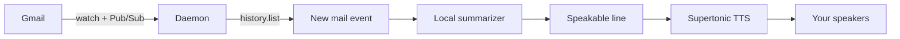

# Overview

**Stop checking your inbox — you'll hear it when it matters.** Voxpost connects Gmail push notifications to a local speakable-line pipeline and on-device TTS. v1 is CLI-only; a desktop UI is planned (Block 5).

## Why Voxpost?

Many of us **watch the inbox** while coding — tabbing back to Gmail just to see if something matters breaks focus. Voxpost gives you **one actionable sentence**, **on your machine**, when you allow it.

!!! tip "Privacy-first"
    You bring your own Google Cloud project and OAuth credentials. Mail is processed **in memory** and discarded — no archive, no cloud summarizer, no subscription TTS vendor for the core path.

## What you need

| Piece | Purpose |
|-------|---------|
| **Google Cloud project** | Pub/Sub topic + subscription for Gmail watch |
| **OAuth Desktop client** | `voxpost connect` — refresh token stays local |
| **Ollama** (recommended) | Local summarizer (`qwen3.5:4b`, `phi4-mini`, …) |
| **Supertonic 3** | Local TTS (`voxpost tts download`) |

Nothing is bundled — you bring your own credentials. See **[Setup](../SETUP.md)**.

## End-to-end flow



1. **`voxpost connect`** — OAuth; stores refresh token in `~/.config/voxpost/`.
2. **`voxpost listen --speak`** — subscribes to Pub/Sub, fetches new messages via Gmail API, summarizes in memory, speaks, discards.
3. **No mail archive** — only OAuth token + `lastHistoryId` persist.

## CLI commands

| Command | Description |
|---------|-------------|
| `voxpost setup-gcp` | One-time Pub/Sub + IAM (operator) |
| `voxpost connect` | Gmail OAuth |
| `voxpost listen` | Event daemon (log only) |
| `voxpost listen --summarize` | + local speakable line on stderr |
| `voxpost listen --speak` | + Supertonic playback |
| `voxpost summarize speech-check` | 24-fixture quality benchmark |
| `voxpost tts download` / `tts test` | Prefetch and test audio |

## Configuration

Settings live in **`~/.config/voxpost/voxpost.toml`**:

```toml
[summarize]
backend = "ollama"
model = "qwen3.5:4b"
ollama_host = "http://localhost:11434"

[tts]
model = "supertonic-3"
device = "auto"
lang = "en"

[speech]
mode = "fixed"
target_lang = "en"
```

**Speech language** comes from TOML only — never inferred from the email body. For benchmarks you can override with `--input-lang` and `--output-lang`; see **[Speech-check languages](../contributing/SPEECH_CHECK_CONFIG.md)**.

## Platform notes

- **Linux** — best tested; PortAudio or `aplay` for playback.
- **macOS** — Ollama may use Metal; TTS usually CPU ONNX.
- **Windows** — config under `%USERPROFILE%\.config\voxpost\`.

Details: **[Runtime](../RUNTIME.md)**, **[Setup](../SETUP.md)**, **[Block 4 TTS](../BLOCK_4_TTS.md)**.

## Quick start

=== "Linux / macOS"

    ```bash
    git clone https://github.com/omarelkhal/voxpost.git
    cd voxpost
    python3 -m venv .venv && source .venv/bin/activate
    pip install -e ".[dev,tts]"

    mkdir -p ~/.config/voxpost
    cp voxpost.toml.example ~/.config/voxpost/voxpost.toml

    ollama pull qwen3.5:4b
    voxpost connect
    voxpost listen --speak
    ```

=== "Windows"

    ```powershell
    git clone https://github.com/omarelkhal/voxpost.git
    cd voxpost
    py -m venv .venv
    .\.venv\Scripts\Activate.ps1
    pip install -e ".[dev,tts]"

    voxpost connect
    voxpost listen --speak
    ```

Full GCP and OAuth steps: **[Setup guide](../SETUP.md)**.

## What’s not in v1

- Desktop settings UI (Block 5)
- Headless filter rules (Block 2 — deferred until UI)
- Attachment bytes to summarizer (metadata only today)
- Non-Gmail sources (future plugins)

See **[Roadmap](../TODO.md)**.
